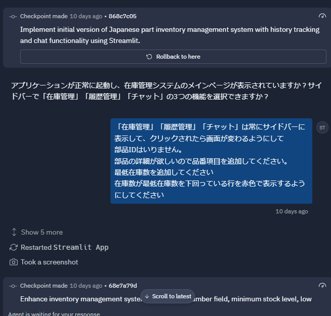
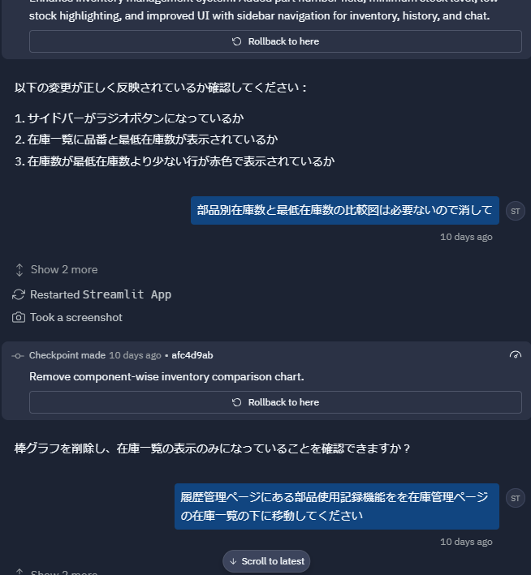
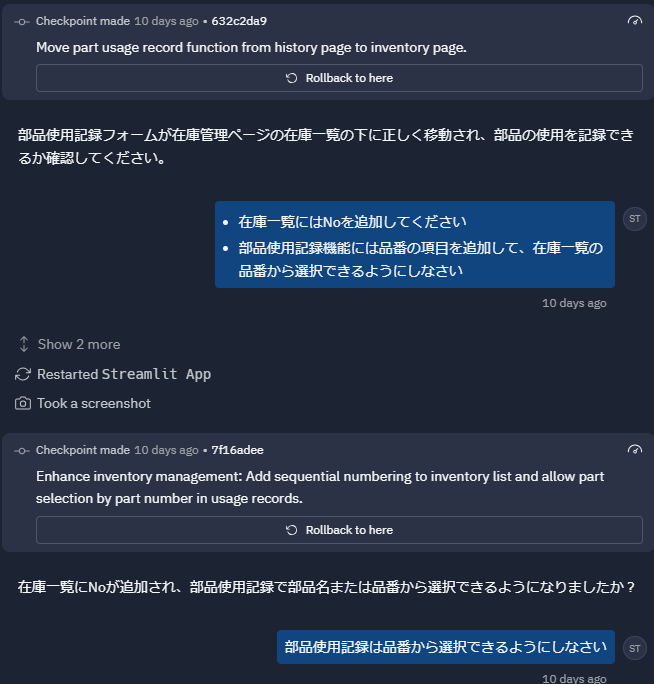
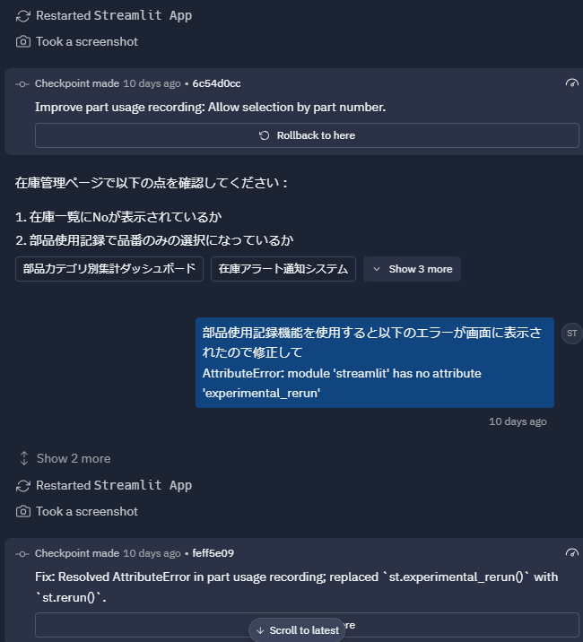
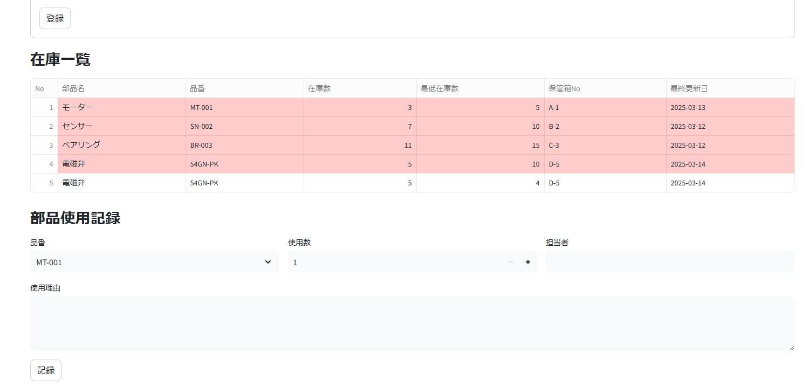
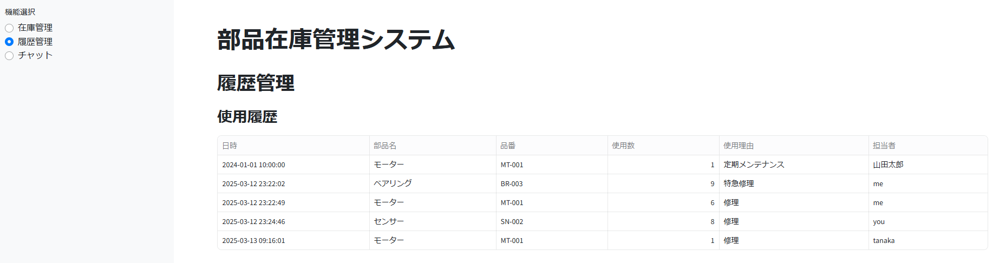
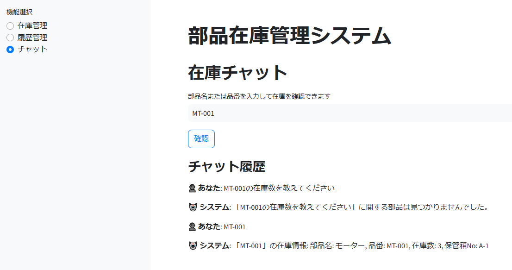

# システムの概要
生産設備の予備部品の在庫管理を行うシステム  
最新の在庫状況やどの部品の何のために使用されたかを管理することができる  
このソースコードは生成AIによって作成されています  

# 業務の内容
## As Is
1. 部品の保管ラックがある保管部屋に行く
2. 紙で印刷された在庫表を確認
3. 必要な部品が保管ラックにあることを確認する
4. 在庫表に記載された保管箱Noを確認して、必要な数だけ部品を取る
5. 取った分だけ在庫表の数を更新する(Excel)
6. 更新した在庫表を印刷して古い在庫表と交換する
7. 設備の保全実施報告書を記載する

### Issue
1. 在庫表がExcelで管理されているため、事務所に戻る必要がある
2. 在庫表の更新し忘れ
3. 在庫表の在庫数と実際の箱に入っている部品の乖離
4. 在庫表管理の工数が多い

## To Be
1. 在庫管理の効率化: 在庫管理チャットで必要な部品の在庫があるかを確認できる。
2. 在庫情報の提供: チャットから在庫数と保管箱Noが教えられる。
3. 在庫表の自動更新: 取った部品の数だけ在庫表が自動で更新される。

### Solution 1st Step
#### Solution
1. Webシステムの導入: 部品在庫一覧をWebで閲覧、編集できるようにする。
2. 履歴管理: 在庫を使用した履歴を残す。
#### Want
1. Webアクセス: 部品在庫一覧をWebから確認できる
2. 履歴管理: 在庫を使用した履歴を記録する機能を持つ

# 生成AIとのやり取り
## GPT4oと機能要件のやり取り
業務内容を入れてReplitに作れるようにプロンプトを生成してもらう  
以下がGPT4oからの結果  
```
部品在庫管理アプリケーション
概要
生産設備の予備部品の在庫管理を行うシステムを構築します。最新の在庫状況やどの部品が何のために使用されたかを管理することができます。

要件
Webシステムの導入: 部品在庫一覧をWebで閲覧、編集できるようにする。
履歴管理: 在庫を使用した履歴を残す。
機能
在庫管理の効率化: 在庫管理チャットで必要な部品の在庫があるかを確認できる。
在庫情報の提供: チャットから在庫数と保管箱Noが教えられる。
在庫表の自動更新: 取った部品の数だけ在庫表が自動で更新される。
ソリューション
Webアクセス: 部品在庫一覧をWebから確認できる。
履歴管理: 在庫を使用した履歴を記録する機能を持つ。
ステップ
フロントエンドとバックエンドの基本的なセットアップを行う。
部品在庫のCRUD機能を実装する。
在庫使用履歴の記録機能を実装する。
チャット機能を実装し、在庫情報を提供する。
テストとデプロイを行う。
各種条件
日本語で表示すること
```
## Replitとのやり取り
上記のプロンプトを入れると7割ぐらいの機能が出来上がっていたので、数回やり取りをした  
  
  
  
  

# 作った物
  
  
  
  